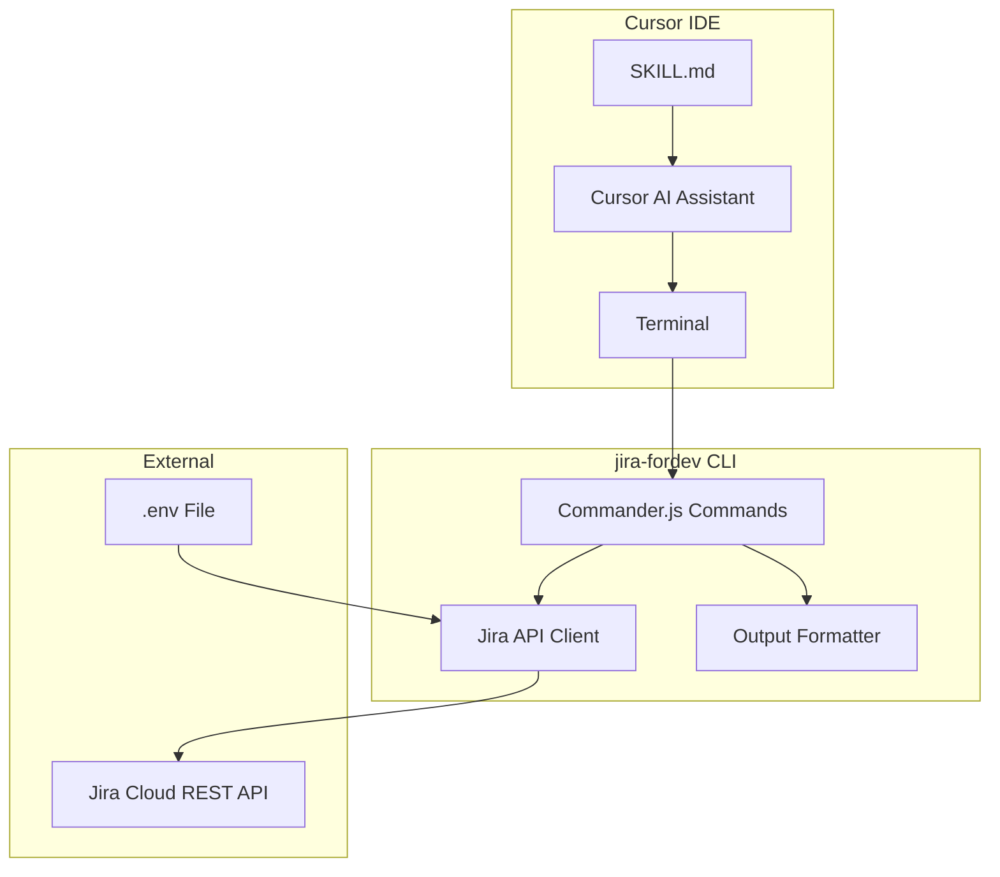

# Jira CLI Tool for Cursor

## Overview

A TypeScript-based CLI tool (`jira-cli`) packaged as an **installable npm module** that allows developers to interact with Jira Cloud directly from the terminal. Includes a **Cursor Skill** (`SKILL.md`) so the AI assistant knows how to use the CLI effectively in any project.

## Installation Methods

The package will support three installation approaches:

1. **Global install** (available everywhere):
  ```bash
   npm install -g jira-fordev
   jira list -p MYPROJECT
  ```
2. **Local dev dependency** (project-specific):
  ```bash
   npm install --save-dev jira-fordev
   npx jira list -p MYPROJECT
  ```
3. **Direct npx** (no install needed):
  ```bash
   npx jira-fordev list -p MYPROJECT
  ```

## Authentication

Jira Cloud uses API tokens for authentication:

- User creates an API token at [https://id.atlassian.com/manage-profile/security/api-tokens](https://id.atlassian.com/manage-profile/security/api-tokens)
- Credentials stored in `.env` file (gitignored):
  ```
  JIRA_HOST=https://your-domain.atlassian.net
  JIRA_EMAIL=your-email@example.com
  JIRA_API_TOKEN=your-api-token
  ```

## CLI Commands

```
jira list [options]              # List/search tickets
  --project, -p <key>            # Filter by project (e.g., DEV)
  --status, -s <status>          # Filter by status (e.g., "In Progress")
  --assignee, -a <user>          # Filter by assignee (email or "me")
  --sprint <name>                # Filter by sprint name
  --epic <key>                   # Filter by epic key
  --type, -t <type>              # Filter by type (bug, task, story)
  --jql <query>                  # Custom JQL query
  --limit, -l <n>                # Max results (default: 20)

jira view <ticket-key>           # View ticket details

jira comment <ticket-key> <text> # Add comment to ticket

jira status <ticket-key> [status] # View or update ticket status
  --list                         # List available transitions

jira create [options]            # Create new ticket
  --project, -p <key>            # Project key (required)
  --type, -t <type>              # Issue type: bug, task, story (required)
  --summary, -s <text>           # Summary/title (required)
  --description, -d <text>       # Description
  --assignee, -a <user>          # Assignee email
  --sprint <name>                # Sprint name
  --epic <key>                   # Parent epic key

jira assign <ticket-key> <user>  # Assign ticket to user
jira --help                      # Instructions to operate in different commands
```

## Project Structure

```
jira-fordev/
├── src/
│   ├── index.ts                 # CLI entry point (with shebang)
│   ├── commands/
│   │   ├── list.ts              # List/search command
│   │   ├── view.ts              # View ticket command
│   │   ├── comment.ts           # Add comment command
│   │   ├── status.ts            # Status transitions command
│   │   ├── create.ts            # Create ticket command
│   │   └── assign.ts            # Assign ticket command
│   ├── api/
│   │   └── jira-client.ts       # Jira REST API client wrapper
│   ├── utils/
│   │   ├── config.ts            # Config/env loading
│   │   └── formatter.ts         # Output formatting (tables, colors)
│   └── types/
│       └── jira.ts              # TypeScript types for Jira entities
├── SKILL.md                     # Cursor AI skill instructions
├── .env.example                 # Example env file
├── .gitignore
├── package.json                 # With bin config for CLI
├── tsconfig.json
└── README.md                    # Setup & usage docs
```

## NPM Package Configuration

Key `package.json` settings for installability:

```json
{
  "name": "jira-fordev",
  "version": "1.0.0",
  "bin": {
    "jira": "./dist/index.js"
  },
  "files": ["dist", "SKILL.md", ".env.example"],
  "main": "./dist/index.js",
  "scripts": {
    "build": "tsc",
    "prepublishOnly": "npm run build"
  }
}
```

## Key Dependencies

- `commander` - CLI argument parsing
- `axios` - HTTP client for Jira API
- `dotenv` - Environment variable loading
- `chalk` - Terminal colors
- `cli-table3` - Table formatting for list output

## Cursor Skill (SKILL.md)

The `SKILL.md` file teaches Cursor AI how to use the CLI. Users copy this to their project's `.cursor/skills/` folder or reference it directly.

**SKILL.md contents will include:**

- When to use each command
- Example workflows (e.g., "create bug ticket and assign to me")
- How to interpret output
- Common JQL patterns for filtering
- Error handling guidance

**Example skill trigger phrases:**

- "Show me my open tickets"
- "Create a bug ticket for the login issue"
- "Update PROJ-123 status to In Review"
- "Add a comment to ticket PROJ-456"
- "Assign PROJ-789 to [john@company.com](mailto:john@company.com)"

## Implementation Notes

1. **Jira API**: Uses REST API v3 (`/rest/api/3/`) with Basic Auth (email + API token)
2. **JQL Builder**: Commands build JQL queries for filtering (sprint, epic, type filters)
3. **Transitions**: Status updates use `/transitions` endpoint - must fetch available transitions first
4. **Sprint/Epic**: Requires knowing custom field IDs (varies per Jira instance) - will auto-detect on first run
5. **Output**: Clean terminal output with colors and tables for better readability
6. **Skill Integration**: SKILL.md provides Cursor AI with command knowledge and usage patterns

## Architecture Diagram



## Usage in Another Project

After publishing, users can integrate into their project:

```bash
# 1. Install the CLI
npm install --save-dev jira-fordev

# 2. Copy the skill to their project (enables Cursor AI integration)
cp node_modules/jira-fordev/SKILL.md .cursor/skills/jira-cli.md

# 3. Set up environment variables
cp node_modules/jira-fordev/.env.example .env
# Edit .env with their Jira credentials

# 4. Use via npx or add npm scripts
npx jira list -p MYPROJECT
```

The README will include these setup instructions prominently.


